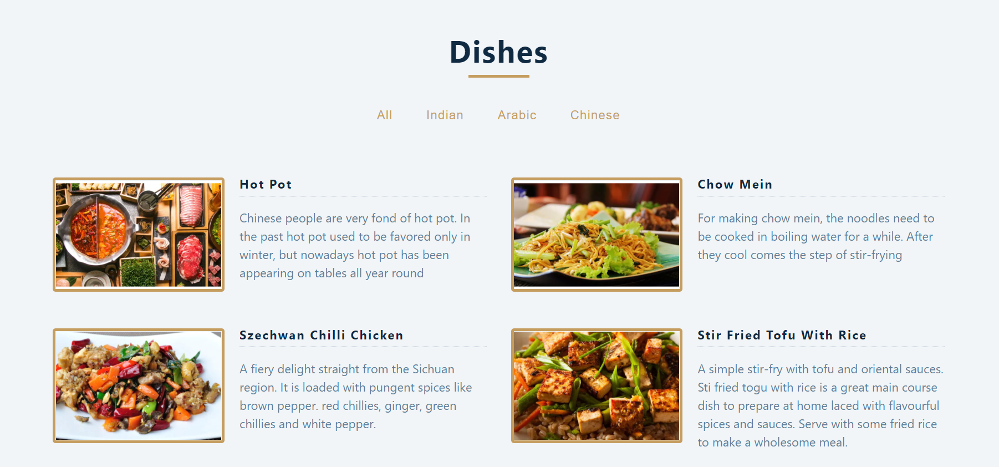
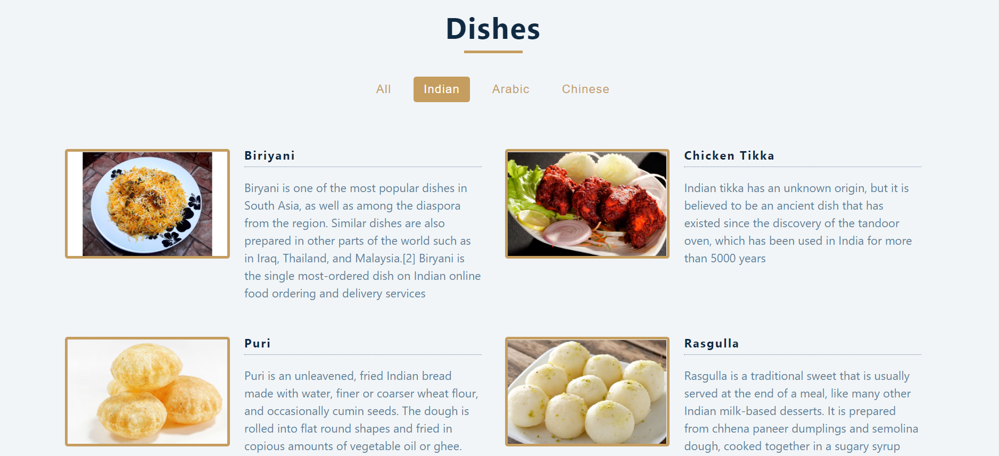

## Food Items Filtering

#### Example:

A Web App used to filter Food Items Based on thier Invented Countries, built with React, JavaScript, and CSS.

## Note
Just a Random Small Project without Database. 

## Project Screen Shot(s)

## Installation and Setup Instructions

#### Example:  

Clone down this repository. You will need `node` and `npm` installed globally on your machine.  

Installation:

`npm install`  

To Run Test Suite:  

`npm test`  

To Start Server:

`npm start`  

To Visit App:

`localhost:3000`  

## Reflection

  - This Project is Created Only for Fun.
  - As a React Js Learner It's Really Interesting Task for me.
  - React JS is the Heart of this Project. useState Hook is used in this project mainly.  

#### Example:  

This was Created in 2 days. The Main Obstacel is Designing the Web page and Collecting Data for Website.

